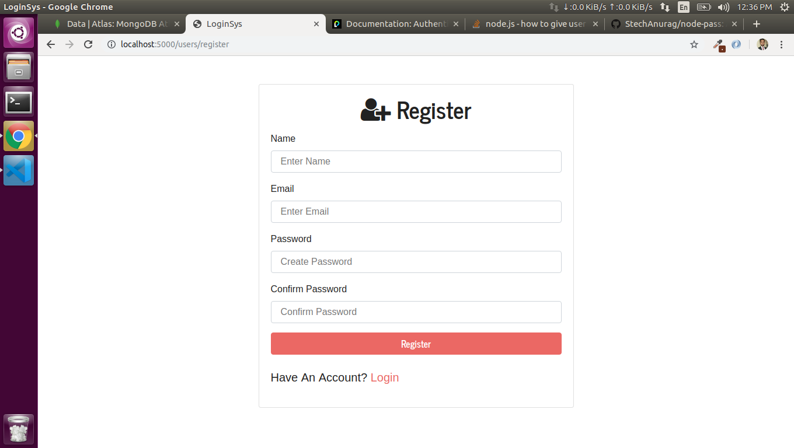
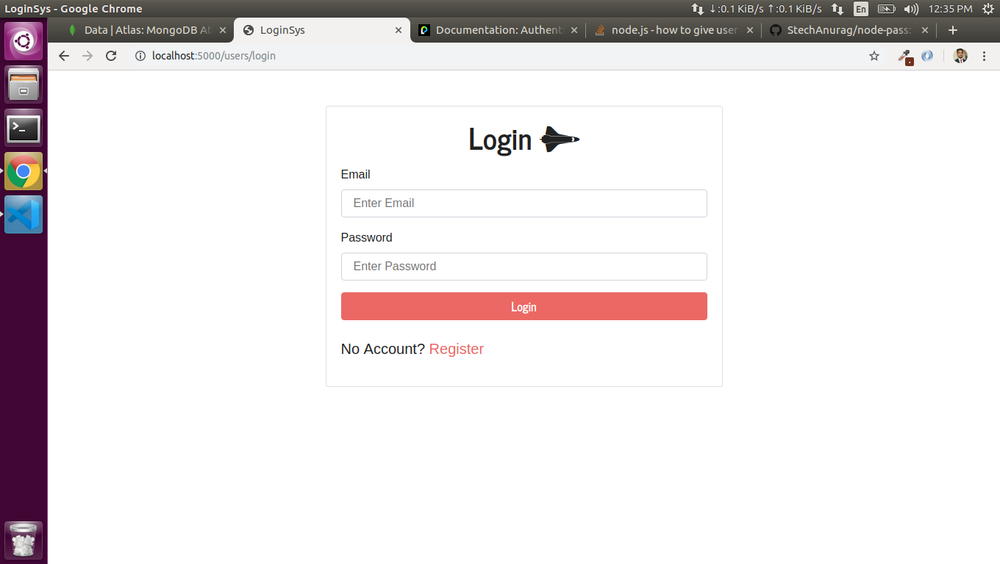

# PassportJS Local Login System

This is a simple Node-Express app which serves a Server side rendered simple passport local Login system.
Passport.JS has been used in the core of it.


### Prerequisites
Before you get started, please have the following requirements fulfilled - 
 - Node.JS and npm installed
 - MongoDB Atlas account and setup
 - Basic knowledge of Node.JS

check node js installation
```
node -v
npm -v
```

## Getting Started

Plese follow the instructions below to get started -
 - clone the repo and cd into it
 - run the following command
    ````
    npm install

    ````
 - before you start the server you need to pass your own MongoDB Atlas credentials in config/key.js file
 - ater that just run the app in - 
    Development mode
    ```
    npm run dev
    ```
    Production Mode
    ```
    npm start
    ```




## Built With

* [Node JS]() - The popular JavaScript runtime
* [Express JS]() - A fast HTTP web-application framework
* [Passport JS]() - Used for authentication of a user
* [MongoDB]() - A NoSQL Database for storing user information


## Author

* **Anurag Shrivastava** - *All work* - [StechAnurag](https://github.com/StechAnurag)

